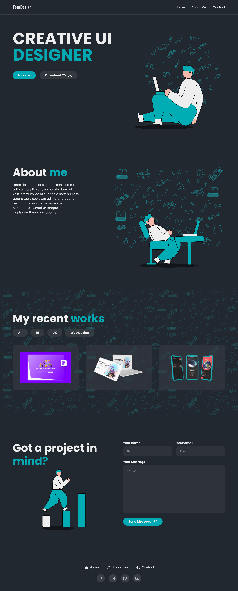

# Simple responsive LANDING Page

This is a solution to the Simple responsive LANDING Page from FIGMA to HTML CSS JS with navigation and filter.

## Table of contents

  - [The challenge](#the-challenge)
  - [Link](#link)
  - [Built with](#built-with)
  - [What I learned](#what-i-learned)
  - [Screenshot](#screenshot)

### The challenge

Users should be able to:

- View the optimal layout for the site depending on their device's screen size
- See hover states for all interactive elements on the page
- Be able to use header and footer navigation

### Link

- Live Site URL: ()

### Built with

- Semantic HTML5 markup
- SCSS
- Flexbox
- CSS Grid
- Mobile-first workflow
- JS

### What I learned

I had more practice with JS. I learned how to work with filters and how to create easy navigation on the page.

### Screenshot

